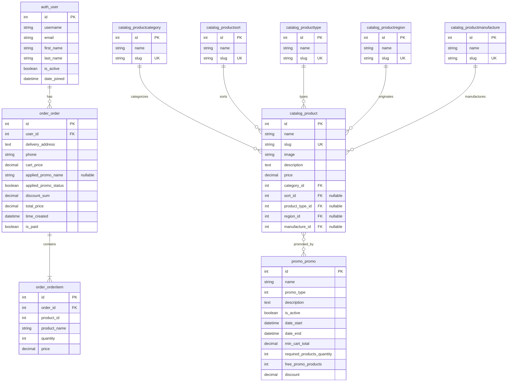

# COF - Coffee & Tea Internet Shop

[](https://djangoproject.com/)
[](https://python.org/)
[](https://docker.com/)
[](https://postgresql.org/)

## Description

Hi, everyone! It's my first large PET-project.

This e-commerce project was created while learning how to work with the Django framework.
By examining the project code, you'll understand the principles of authentication, authorization, shopping cart, 
pagination, templates and views, order processing, using promo, and email notifications.

## 🚀 Features

- **Modern Architecture**: Django 5.2+ with type hints and comprehensive docstrings
- **Microservice Structure**: Modular applications (catalog, cart, order, promo, users)
- **Containerization**: Full Docker configuration with PostgreSQL and Nginx
- **Security**: CSRF protection, data validation, secure cookies
- **Performance**: Gunicorn with gevent, optimized database queries
- **Testing**: Comprehensive test coverage with pytest
- **Code Quality**: Ruff for linting and formatting

## 🛠️ Tech Stack

### Backend
- **Django 5.2.4** - web framework
- **Python 3.11+** - programming language
- **PostgreSQL 17** - database
- **Gunicorn + Gevent** - WSGI server
- **Nginx** - web server and proxy

### Development Tools
- **Poetry** - dependency management
- **Docker & Docker Compose** - containerization
- **pytest** - testing framework
- **Ruff** - linting and formatting
- **Django Extensions** - additional commands

## 📋 Requirements

- Python 3.11+
- Docker & Docker Compose
- Poetry (optional)

## 🚀 Quick Start

### With Docker (Recommended)

1. **Clone the repository:**
```bash
git clone https://gitlab.com/srt-2000/cof.git
cd cof
```

2. **Configure environment variables:**
```bash
# Edit the .env.example file with your configuration values
nano .example

# After editing, rename the file to .env
mv .env.example .env
```

3. **For local development, configure the following:**

**In `.env` file:**
```env
ALLOWED_HOSTS=127.0.0.1 localhost [::1]
DEBUG=True
```

**In `nginx/coffeeshop_nginx.conf`, comment out lines 8, 9, 10, 18, 19, 20:**
```nginx
# location /.well-known/acme-challenge/ {
#     root /var/www/certbot;
# }

# server {
#     listen 443 ssl;
#     ssl_certificate /etc/letsencrypt/live/srt-tester.ru/fullchain.pem;
#     ssl_certificate_key /etc/letsencrypt/live/srt-tester.ru/privkey.pem;
```

**In `docker-compose.yml`, comment out lines 83-90:**
```yaml
# certbot:
#   image: certbot/certbot
#   volumes:
#     - ./certbot/conf:/etc/letsencrypt
#     - ./certbot/www:/var/www/certbot
#   command: certonly --webroot --webroot-path=/var/www/certbot/ --email srt2000888tester@gmail.com --agree-tos --no-eff-email -d srt-tester.ru
#   depends_on:
#     - nginx
```

4. **Start the application:**
```bash
docker-compose up -d
```

5. I've created a custom command for loading test data.
   After it - we can start with no empty database - **Load test data:** 
```bash
docker-compose exec coffeeshop python manage.py loadtestdata
```

The application will be available at: http://localhost

## 🔧 Configuration

### Environment Variables

The project includes a `.env.example` file with all required environment variables. 
You need to:

1. **Edit the `.env.example` file** with your configuration values
2. **Rename it to `.env`** after configuration

Example configuration:
```.env
# Django
SECRET_KEY=your-secret-key-here
DEBUG=True
ALLOWED_HOSTS=127.0.0.1 localhost [::1]

# Database
DATABASE_ENGINE=django.db.backends.postgresql
DATABASE_NAME=cof_db
DATABASE_USERNAME=postgres
DATABASE_PASSWORD=your-password
DATABASE_HOST=localhost
DATABASE_PORT=5432

# Email
EMAIL_HOST=smtp.gmail.com
EMAIL_PORT=587
EMAIL_USE_TLS=True
GMAIL_HOST_USER=your-email@gmail.com
GMAIL_APP_PASSWORD=your-app-password
ADMIN_EMAIL=admin@example.com
```

## 🧪 Testing & Code Quality

### Running Tests
```bash
# Run tests with Docker
docker-compose -f docker-compose.test.yml up test-coffeeshop

# Or you can run tests locally
pytest
```

### Code Linting
```bash
# Run linting with Docker
docker-compose -f docker-compose.test.yml up test-coffeeshop-lint

# Or you can run linting locally
ruff check .
ruff format .
```

## 📊 Database Structure

The database structure consists of core entities for products, orders, promotions, and users. The following ERM diagram illustrates the relationships between all database models:



### Entity Relationships

- **auth_user → order_order** (One-to-Many): A user can have multiple orders. Orders are deleted when a user is deleted (CASCADE).

- **order_order → order_orderitem** (One-to-Many): An order contains multiple order items. Order items store a snapshot of product data (product_id, product_name, price) at the time of order creation.

- **catalog_productcategory → catalog_product** (One-to-Many): Each product belongs to a category. Categories are protected from deletion if products exist (PROTECT).

- **catalog_productsort/producttype/productregion/productmanufacture → catalog_product** (One-to-Many, Optional): Products can optionally have sort, type, region, and manufacturer attributes. These relationships allow NULL values (SET_NULL).

- **catalog_product ↔ promo_promo** (Many-to-Many): Promo codes can be associated with multiple products, and products can have multiple promo codes. Promos support two types: TOTAL_CART (discount on entire cart) and FREE_PRODUCT (free products promotion).

## 🚀 Deployment

### Production Settings

1. **Configure environment variables for production**
2. **Start the application:**
```bash
docker-compose up -d
```

3. **Configure SSL certificates (optional):**
```bash
# Uncomment certbot in docker-compose.yml
docker-compose up -d nginx
docker-compose run --rm certbot certonly --webroot --webroot-path=/var/www/certbot/ -d your-domain.com
```

## 📁 Project Structure

```
coffeeshop/
├── catalog/                 # Product catalog
│   ├── models.py           # Product models
│   ├── views.py            # Catalog views
│   ├── filters.py          # Product filters
│   └── management/         # Django commands
├── cart/                   # Shopping cart
│   ├── cart.py            # Cart logic
│   ├── storage.py         # Cart storage
│   └── product_service.py  # Product service
├── order/                  # Orders
│   ├── models.py          # Order models
│   ├── services.py       # Business logic
│   └── forms.py           # Order forms
├── promo/                  # Promo codes
│   ├── models.py          # Promo models
│   ├── promo.py           # Promo logic
│   └── promo_factory.py   # Promo factory
├── users/                  # Users
│   ├── authentication.py  # Custom authentication
│   └── forms.py           # User forms
└── config/                # Django settings
    ├── settings.py        # Main settings
    ├── urls.py           # URL routes
    └── wsgi.py           # WSGI configuration
```

## 👨‍💻 Author

**srt-2000** - [srt2000888@gmail.ru](mailto:srt2000888@gmail.ru)

## 🔗 Useful Links

- [Django Documentation](https://docs.djangoproject.com/)
- [Docker Documentation](https://docs.docker.com/)
- [PostgreSQL Documentation](https://www.postgresql.org/docs/)
- [pytest Documentation](https://docs.pytest.org/)